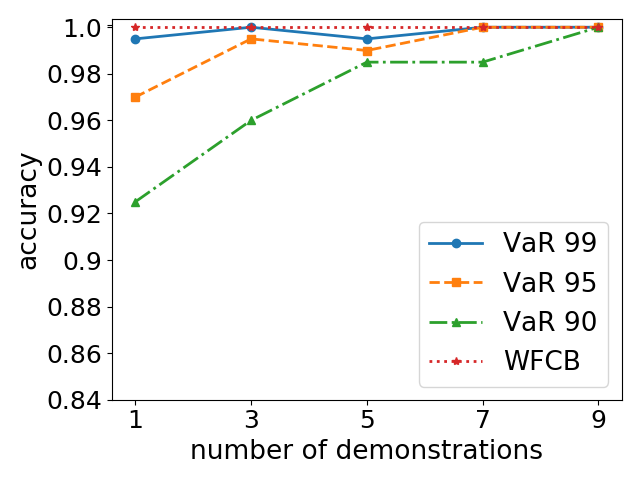
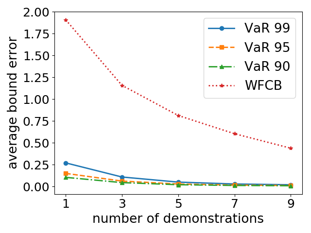
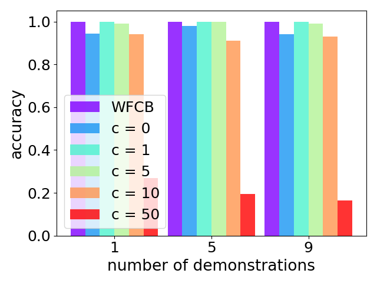
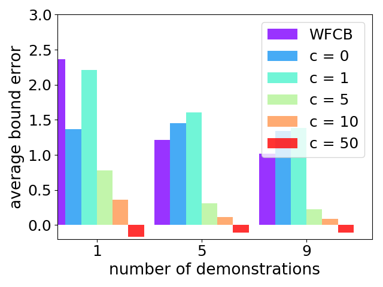
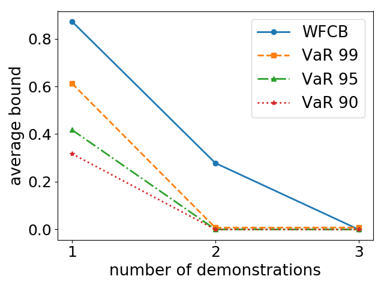

# Efficient Probabilistic Performance Bounds for Inverse Reinforcement Learning
## Daniel S. Brown and Scott Niekum

In the field of reinforcement learning there has been recent progress towards safety and high-confidence bounds on policy performance. However, to our knowledge, no practical methods exist for determining high-confidence policy performance bounds in the inverse reinforcement learning setting---where the true reward function is unknown and only samples of expert behavior are given. We propose a sampling method based on Bayesian inverse reinforcement learning that uses demonstrations to determine practical high-confidence upper bounds on the α-worst-case difference in expected return between any evaluation policy and the optimal policy under the expert's unknown reward function. We evaluate our proposed bound on both a standard grid navigation task and a simulated driving task and achieve tighter and more accurate bounds than a feature count-based baseline. We also give examples of how our proposed bound can be utilized to perform risk-aware policy selection and risk-aware policy improvement. Because our proposed bound requires several orders of magnitude fewer demonstrations than existing high-confidence bounds, it is the first practical method that allows agents that learn from demonstration to express confidence in the quality of their learned policy.

### Follow the instructions below to reproduce results in our [AAAI 2018](https://arxiv.org/abs/1707.00724) and our [AAAI 2017 Fall Symposium](https://www.cs.utexas.edu/~dsbrown/pubs/Brown_AAAIFS17.pdf) papers.


## Citations

```
@inproceedings{brown2018probabilistic,
     author = {Brown, Daniel S. and Niekum, Scott},
     title = {Efficient Probabilistic Performance Bounds for Inverse Reinforcement Learning},
     booktitle = {AAAI Conference on Artificial Intelligence},
     year = 2018,
     url={https://arxiv.org/abs/1707.00724}
}

@inproceedings{brown2017toward,
     author = {Brown, Daniel S. and Niekum, Scott},
     title = {Toward Probabilistic Safety Bounds for Robot Learning from Demonstration},
     booktitle = {AAAI Fall Symposium: Artificial Intelligence for Human-Robot Interaction},
     year = 2017,
     url={https://aaai.org/ocs/index.php/FSS/FSS17/paper/view/16023/15282}
}
```
 
  #### Dependencies
  - Matplotlib (for generating figures): https://matplotlib.org/users/installing.html
  - SDL (only needed for car driving experiments):  ` sudo apt-get install libsdl-image1.2-dev libsdl1.2-dev libsdl-ttf2.0-dev`
  
  #### Getting started
  - Make a build directory: `mkdir build`
  - Make a data directory to hold results: `mkdir data`
  
  #### Infinite Horizon GridWorld (Figure 2 in [AAAI 2018 paper](https://arxiv.org/abs/1707.00724))
  - Use `make gridworld_basic_exp` to build the experiment.
  - Execute `./gridworld_basic_exp` to run. Data will be output to `./data/gridworld`
  - Experiment will take some time to run since it runs 200 replicates for each number of demonstrations. Experiment parameters can be set in `src/gridWorldBasicExperiment.cpp`. 
  - Once experiment has finished run `python scripts/generateGridWorldBasicPlots.py` to generate figures used in paper.
  - You should get something similar to the following two plots

<div>
  
  
</div>
  
  
  #### Sensitivity to Confidence Parameter (Figure 3 in [AAAI 2018 paper](https://arxiv.org/abs/1707.00724))

  - Use `make gridworld_noisydemo_exp` to build the experiment.
  - Execute `./gridworld_noisydemo_exp` to run. Data will be output to `./data/gridworld_noisydemo_exp/`
  - Experiment will take some time to run since it runs 200 replicates for each number of demonstrations. Experiment parameters can be set in `src/gridWorldNoisyDemoExperiment.cpp`. 
  - Once experiment has finished run `python scripts/generateNoisyDemoPlots.py` to generate figures used in paper.
  - You should get something similar to the following two plots

<div>
  
  
</div>

   - Note that the bounds when c=0 are different than shown in paper. We are working on determining the reason for this discrepancy.
  
  
  #### Comparison with theoretical bounds (Table 1 in in [AAAI 2018 paper](https://arxiv.org/abs/1707.00724))
  - Use `make gridworld_projection_exp` to build the experiment.
  - Execute `./gridworld_projection_exp` to run. Data will be output to `./data/abbeel_projection/`
  - Experiment will take some time to run since it runs 200 replicates for each number of demonstrations. Experiment parameters can be set in `src/gridWorldProjectionEvalExperiment.cpp`. 
  - Once experiment has finished run `python scripts/generateProjectionEvalData.py` to generate data used in paper.
  - We reran the experiment from our paper and got the following results (slightly different from paper due to random seeding):
  
   | Bound            | 1 demo | 5 demos | 9 demos | 23052 demos | Ave Accuracy |
| ------------------- |:-----:   | :----:   | :----:    | :----:        | :----:        |
| 0.95-VaR EVD Bound  |  0.9392 | 0.2570 | 0.1370 | - | 0.98|
| 0.99-VaR EVD Bound  |1.1448  | 0.2972  | 0.1575 | - |  1.0 |
| Syed and Schapire 2008  | 142.59 | 63.77  | 47.53   | 0.9392 | 1.0 |
  
  
  #### Policy Selection for Driving Domain
  - Use `make driving_experiment` to build experiment.
  - Execute `./driving_experiment right_safe`, `./driving_experiment on_road`, and `./driving_experiment nasty` to run experiments and output results to `./data/driving/`.
  - Once all experiments have finished run `python scripts/calculateDrivingRankings.py` to output results.
  - Due to some changes in code and random seed the results are slightly different than in the paper. 
  - You should get results similar to the following:
  
| Eval Policy           | WFCB | VaR 95 | 
| ------------------- |:-----:   | :----:|
|right_safe | 5.87 | 1.08|
|on_road | 1.81 | 1.14|
|nasty | 4.39 | 2.60|

  
  #### Policy Improvement (Figure 4 in [AAAI 2018 paper](https://arxiv.org/abs/1707.00724))
  - Use `make improvement_exp` to build the experiment.
  - Execute `./improvement_exp` to run. 
  - The minimum VaR policy will be printed to the terminal. 
  
  
  #### Demonstration Sufficiency (Figure 4 in  [AAAI 2017 Fall Symposium Paper](https://www.cs.utexas.edu/~dsbrown/pubs/Brown_AAAIFS17.pdf))
  - Use `make demo_sufficiency_exp` to build the experiment.
  - Execute `./demo_sufficiency_exp` to run. Data will be output to `./data/demo_sufficiency/`
  - Once experiment has finished run `python scripts/generateDemoSufficiencyPlot.py` to generate plot 4 (b).
  - You should get the following figure.
  <div>
  
  </div>
  
   - Note that given a non-zero safety threshold on Value-at-Risk, say &epsilon; = 0.01, the agent would be able to report that it had learned the given task after two demonstrations, whereas using only feature counts makes it seem like three demonstrations are needed.
   
   
  

